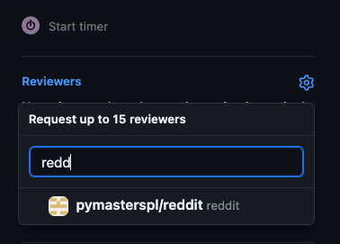

# Reddit
Reddit clone for educational purposes. Developed by PyMasters
Want to join and work on it? https://pymasters.pl/spolecznosc

## Rules of engagement
Good reading on working with code changes and pull request is https://google.github.io/eng-practices/. It contains both views - change author and reviewer.

### Rules

1. We use ClickUp to manage tasks: https://app.clickup.com/9012000285/v/l/8cjgdgx-412
    - Kanban Board is used for ongoing work
    - Kanban Backlog is used to store ideas in form of tasks, for reviewing and moving to Kanban Board. 
    - Tasks must follow precise life cycle
        - when task is created in Kanban Backlog the status is "BACKLOG"
        - when task is created in Kanban Board, or moved to Kanban Board from Kanban Backlog, status is set to "TO DO". 
        - when work is started, task is moved into "IN PROGRESS", and stays in this state until **pull request is merged to dev**
        - after pull request is merged, status of the task is changed to "READY FOR QA"
        - after QA is done, the person who is performing QA is setting the task as "DONE". 
            - if issues are found the task is moved back to "TO DO" with comments or new task is created to address those issues.
2. Do not commit directly to `master` or `dev`. Both branches are protected.
3. Check your code with `ruff check` prior to creating pull requests. The code is checked against PEP8 using `ruff`. Violations will not allow merging.
    - fix can be applied by ruff automatically for some issues, check `ruff check --fix`.
4. Follow Git Flow approach while developing. 
   - video explaing git flow is available for Pymasters members at: https://discord.com/channels/1035267230901997628/1135149223306858536/1136744608555089990
       - you can join Pymasters at https://pymasters.pl/spolecznosc     
   - Use pull request to add your work. Make pull request to `dev` branch.
   - After creating pull request use "reviewers" option on far right of the screen to request review from "pymasters/reddit" team, or you can request review from certain team member directly by mentioning their name.
      
   - One of the team members (or multiple) will perform code review and approve the pull request or request changes.
   - If changes are requested, all comments have to be in constructive and friendly manner, as shown in https://google.github.io/eng-practices/review/reviewer/comments.html
   - It's a good thing to comment on the good parts of code with "Nice work" or something similar.
5. As this is a learning project, pair programming is most welcome. Jump on Zoom or google meet and work together: https://www.youtube.com/watch?v=wu6BOT-eMgc&t=105s&ab_channel=devmentor.pl
6. Code quality and automated tests will be run and required to pass before pull request can be merged. 
7. At least one approval by other team member is required before pull request can be merged.
8. After pull request is approved and code quality + tests are passed, pull request is merged by the author.
9. It is author responsibility to watch over pull request, bump if there is no code review done, fix issues and merge pull request.

### Code

- Use class based views instead of function based views. A lot of examples and reading can be found on Jacek Blog: https://akademiait.com.pl/ and youtube: https://www.youtube.com/watch?v=2S9-pvFBlBc&ab_channel=AkademiaIT
- for testing use pytest. Tests using Django Unit Testing will not be accepted. A lot of tests are in our previous project: https://github.com/pymasterspl/Dshop. Also please watch https://www.youtube.com/watch?v=xn3wSM82fnA&ab_channel=AkademiaIT
- If you have questions, just ask on discord, reddit channel.


## How to Set up

Clone repository to specific folder (ex. reddit):
```
git clone https://github.com/pymasterspl/reddit.git
```
You need to have installed Poetry package. If you don't have, please install using this command:
```
pip install poetry
```
Navigate to reddit folder by command:
```
cd reddit
```
Set poetry global option, to use project folder as place to hold Virtual environment (recommended):
```
poetry config virtualenvs.in-project true
```
Install virtual environment, using current dependencies:
```
poetry install
```
Copy file env-template to .env file using command:
```
# linux/mac
cp env-template .env

# windows
copy env-template .env
```
Start poetry virtual environment
```
poetry shell
```

Update local .env file as needed

Create admin account to access admin site:

```
# linux/mac
# to apply db changes
./manage.py migrate 
./manage.py createsuperuser

# windows
# to apply db changes
python manage.py migrate
python manage.py createsuperuser
```


Run project:
```
# linux/mac
# to apply db changes
./manage.py migrate 
# to start project
./manage.py runserver

# windows
# to apply db changes
python manage.py migrate
# to start project
python manage.py runserver
```

Load data from fixtures:
```
python manage.py loaddata {fixture_name}.json
```

Open web browser and navigate to localhost address:  http://127.0.0.1:8000/ 

### Usage with Docker 🐳
For setup and running with Docker, refer to the [Docker configuration instructions](DOCKER.md).

### In case of problems with starting the project:
1. Check the env-template file and update the local .env file if necessary
2. Run `poetry install`

